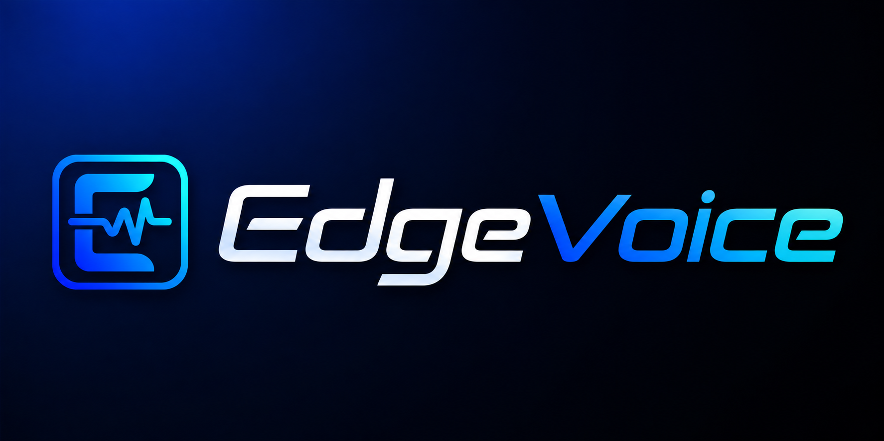

<p align="center">
  <a href="https://flet.dev"></a>
</p>

<p align="center">
    <em>Generate high-quality speech from text with Microsoft Edge's neural voices. For Free!</em>
</p>

<p align="center">


</p>

---

A desktop text-to-speech app built with [Flet](https://flet.dev/) and [`edge-tts`](https://github.com/rany2/edge-tts) for generating Microsoft Edge neural voices as MP3 files.

EdgeVoice gives you a clean GUI for:

- selecting a language, gender, and voice
- previewing voices before generating audio
- tuning rate, volume, and pitch
- generating a single MP3 with optional subtitles
- batch-generating multiple MP3 files from a text list
- saving your preferred theme and voice settings between sessions

---

## Features

### Single generation

- Paste text or load it from a `.txt` file
- Choose an output `.mp3` path
- Optionally generate a matching `.srt` subtitle file
- Generate and immediately play the result in-app

### Bulk generation

- Add rows manually
- Import a text file with **one entry per line**
- Edit or delete individual rows before generation
- Retry only failed rows
- Generate all pending rows into a selected output folder
- Track progress, completed item count, and estimated remaining time

### Voice workflow

- Filter by locale/language and gender
- Preview the selected voice before committing to a full export

### UI/UX details

- Persist theme, voice, and prosody settings in `config.json`
- Light and dark mode toggle

---

## Getting started

### Prerequisites

Make sure you have:

- Python 3.11 or newer
- internet access (for fetching the voice list and generating audio)

### Installation

1. Clone the repository.
2. Install dependencies `pip install -r requirements.txt`.

### Run the app

```powershell
flet run main.py
```

or

```powershell
python main.py
```

---

## Usage

### Single tab workflow

1. Launch the app.
2. Wait for the voice list to finish loading.
3. Choose a language, gender, and voice.
4. Adjust **Rate**, **Volume**, and **Pitch** if needed.
5. Enter text manually or load a `.txt` file.
6. Choose an output `.mp3` path.
7. Optionally enable subtitle export.
8. Click **Generate & Play** or **Save to File**.

### Bulk tab workflow

1. Open the **Bulk** tab.
2. Add rows manually or import a `.txt` file.
3. Choose an output folder.
4. Optionally enable subtitle export.
5. Click **Bulk Generate**.
6. Monitor the progress bar, completed count, and ETA.

---

## Contributing

Issues, fixes, and polish improvements are welcome.

If you plan to contribute:

1. Fork the repository
2. Create a feature branch
3. Make your changes
4. Test the app locally
5. Open a pull request with a clear description

---

## License

No license file is currently included in this repository.
If you plan to publish or accept outside contributions, adding a license is a very good next move.
