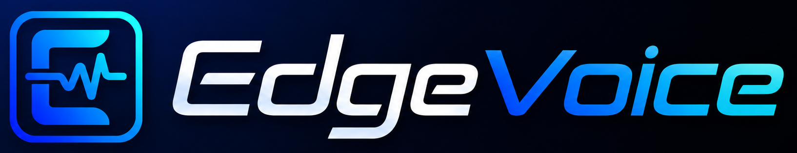
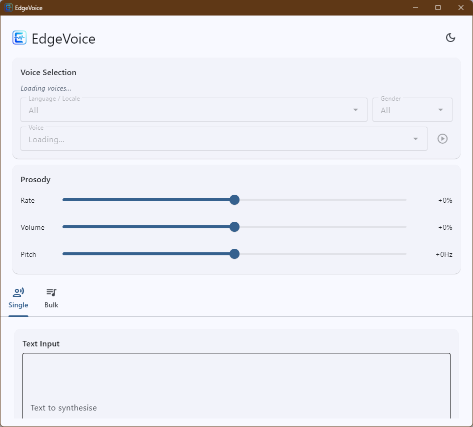

  

  <a href="https://github.com/DerDemystifier/EdgeVoice/releases/download/v1.0.0/EdgeVoice_v1.0.0.zip" target="_blank" style="text-decoration:none;">
    
      ⬇️ Download ZIP
    
  </a>

# EdgeVoice

A GUI desktop text-to-speech app that converts text into speech using Microsoft Edge's neural voices.

Use a clean interface to preview voices, adjust speech settings, export single files, or batch-process text lists.

## Why EdgeVoice

- High-quality Microsoft Edge neural voices
- Instant voice preview before export
- Fine-grained control over rate, volume, and pitch
- Save spoken audio as MP3
- Export matching subtitle files when needed
- Light and dark themes with saved preferences

## Main features

### Single voice export

- Enter text directly or load from a `.txt` file
- Choose language, gender, and voice
- Adjust prosody for natural-sounding speech
- Generate and play audio right away

### Batch generation

- Add items manually or import a text list
- Edit, delete, or retry individual rows
- Export multiple MP3 files to a folder
- Monitor progress and estimated completion time

### Voice discovery

- Filter available voices by language and gender
- Listen before you save

---

---

## Who it’s for

Creators, narrators, accessibility users, and anyone who wants a simple, friendly way to turn text into speech using Microsoft Edge voices.
